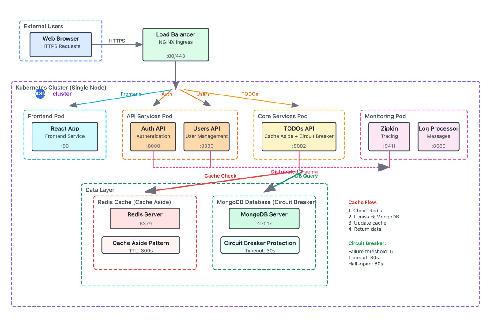

# Team Members
- A00395548 | Silem Nabib Villa Contreras
- A00382203 | Santiago Escobar Leon

# Table of Contents
- [Introduction](#introduction)
- [Branching Strategies](#branching-strategies)
- [Selected Cloud Patterns](#selected-cloud-patterns)
- [Architecture Diagram](#architecture-diagram)
- [Development Pipelines](#development-pipelines)
- [Infrastructure Pipelines](#infrastructure-pipelines)

# Introduction

This project uses a comprehensive **cloud-native microservices architecture** implemented on **Google Cloud Platform (GCP)**, showcasing modern software engineering practices, DevOps automation, and enterprise-grade cloud design patterns. The application serves as a practical implementation of distributed systems principles, combining multiple programming languages, containerization, orchestration, and advanced deployment strategies.

# Branching Strategies

For this project, we have implemented the GitFlow branching strategy, which provides a robust framework for managing both development and operations workflows.

## Development Branching Strategy

Our development branching strategy follows the GitFlow model with the following branches:

- **main**: Production-ready code that has been thoroughly tested and is ready for deployment
- **develop**: Integration branch for features being developed
- **feature/\***: Individual feature branches created from and merged back into develop
- **hotfix/\***: Emergency fixes for production issues, branched from main and merged into both main and develop
- **release/\***: Preparation branches for releases, branched from develop and merged into main and develop

This strategy allows developers to work on features in isolation while maintaining a stable codebase.

## Operations Branching Strategy

For operations, we extend the GitFlow model with environment-specific branches:

- **env/dev**: Configuration specific to the development environment
- **env/prod**: Configuration specific to the production environment
- **infra/\***: Infrastructure changes that are tested in each environment sequentially

This approach ensures that infrastructure changes follow a controlled promotion path from development to production, reducing the risk of configuration drift and deployment issues.

# Selected Cloud Patterns
We will implement the following cloud design patterns:

### Cache-Aside Pattern

The Cache-Aside pattern is implemented in our TODOs API using Redis as the caching layer. This pattern improves performance by reducing database load and latency for frequently accessed data.

#### Implementation Details

**Technology Stack:**
- **Cache Store**: Redis (Cloud Memorystore in production)
- **Implementation**: Node.js with redis client
- **Cache Strategy**: Write-Around with selective invalidation

**Key Features:**
1. **Cache Key Strategy**: Hierarchical key naming for efficient organization
   - User todos: `todos:user:{username}`
   - Individual todos: `todo:{username}:{todoId}`

2. **Cache Operations**:
   - **Cache Hit**: Data retrieved directly from Redis (sub-millisecond response)
   - **Cache Miss**: Data fetched from MongoDB and cached for future requests
   - **Cache Expiry**: 5-minute TTL to ensure data freshness

3. **Write Strategy**: Write-Around pattern implementation
   - New data written directly to database
   - Cache invalidated after write operations
   - Prevents cache pollution with infrequently accessed data

4. **Error Handling**: Graceful degradation when Redis is unavailable
   - Cache failures don't break the application
   - Automatic fallback to database operations

**Performance Benefits:**
- Significantly reduced database load for frequently accessed data
- Improved response times for cached content
- Enhanced system scalability under high concurrent load

**Monitoring**: Comprehensive logging with `[CACHE-ASIDE]` prefixes for operational visibility.

### Circuit Breaker Pattern

The Circuit Breaker pattern is implemented to improve system resilience by preventing cascading failures when the database is unavailable or experiencing high latency.

#### Implementation Details

**Technology Stack:**
- **Library**: Opossum Circuit Breaker for Node.js
- **Target**: MongoDB database operations
- **Scope**: All CRUD operations in TODOs API

**Configuration:**
- **Timeout**: 5 seconds per operation
- **Error Threshold**: 50% failure rate triggers circuit opening
- **Reset Timeout**: 30 seconds before attempting recovery
- **Rolling Window**: 10 seconds with 10 buckets for failure tracking

**Circuit States:**
1. **Closed (Normal)**: All requests pass through to database
2. **Open (Failing)**: Requests immediately rejected, returns 503 Service Unavailable
3. **Half-Open (Testing)**: Limited requests allowed to test service recovery

**Protected Operations:**
- `find()` - List todos queries
- `findOne()` - Single todo retrieval
- `insertOne()` - Todo creation
- `deleteOne()` - Todo deletion
- `updateOne()` - Todo updates

**Error Handling:**
- **Circuit Open**: Returns HTTP 503 with "Service temporarily unavailable"
- **Timeout**: Returns HTTP 503 with "Database temporarily unavailable"
- **Other Errors**: Returns HTTP 500 with generic error message

**Monitoring & Health Checks:**
- Real-time circuit breaker statistics via `/health` endpoint
- Comprehensive event logging for all state transitions
- Integration with application health checks

**Benefits:**
- Prevents database overload during outages
- Faster failure detection and recovery
- Improved user experience with predictable error responses
- System stability under adverse conditions

# Architecture Diagram

The architecture for our microservices application is designed to leverage Google Cloud Platform services for optimal performance, scalability, and reliability. The diagram below illustrates the high-level architecture and the interactions between different components.

## Overview

<div align="center">
  
  <p><em>Architecture diagram showing the microservices components and their interactions</em></p>
</div>

# Development Pipelines

Our development pipeline is implemented using GitHub Actions and follows a comprehensive CI/CD approach that ensures code quality, security, and reliable deployments across all microservices.

## Pipeline Architecture

The development pipeline is triggered on:
- **Push events** to `main` and `develop` branches
- **Pull requests** targeting `main` and `develop` branches  
- **Manual workflow dispatch** for on-demand builds

## Multi-Service Build Strategy

We utilize a **matrix strategy** to build all microservices in parallel, significantly reducing pipeline execution time:

```yaml
strategy:
  matrix:
    service: [auth-api, users-api, todos-api, log-message-processor, frontend]
```

This approach allows simultaneous building and deployment of:
- **auth-api**: Go-based authentication service
- **users-api**: Java Spring Boot user management service
- **todos-api**: Node.js task management service with Redis caching
- **log-message-processor**: Python-based log processing service
- **frontend**: Vue.js web application with Nginx

## Pipeline Stages

### 1. Source Code Checkout
- Retrieves the latest code from the repository
- Ensures all microservice directories are available for building

### 2. Google Cloud Authentication
- Authenticates with GCP using service account credentials
- Enables access to Google Artifact Registry for image storage

### 3. Docker Registry Configuration
- Configures Docker to authenticate with Google Artifact Registry
- Sets up secure image push capabilities

### 4. Multi-Tag Image Building
For each microservice, the pipeline builds Docker images with dual tagging strategy:

**Tag Strategy:**
- **`:latest`** - Always points to the most recent successful build
- **`:${github.sha}`** - Immutable tag tied to specific commit for traceability

**Build Process:**
```bash
IMAGE_LATEST=us-central1-docker.pkg.dev/${PROJECT_ID}/docker-repository/${SERVICE}:latest
IMAGE_SHA=us-central1-docker.pkg.dev/${PROJECT_ID}/docker-repository/${SERVICE}:${COMMIT_SHA}
```

### 5. Kubernetes Manifest Updates
- Automatically updates Kubernetes deployment manifests
- Replaces image references with commit-specific tags
- Ensures deployments use exact code versions for consistency

**Manifest Update Process:**
```bash
IMAGE_URL=us-central1-docker.pkg.dev/${PROJECT_ID}/docker-repository/${SERVICE}:${COMMIT_SHA}
sed -i "s|${OLD_IMAGE_PATTERN}|${IMAGE_URL}|g" k8s/applications/${SERVICE}.yaml
```
## Monitoring & Observability

### Build Metrics
- **Build duration** tracking per microservice
- **Success/failure rates** across different branches
- **Image size optimization** monitoring

### Deployment Traceability
- **Commit SHA tagging** enables precise version tracking
- **Build artifacts** linked to specific code changes
- **Rollback capabilities** using immutable image tags

## Quality Gates

### Pre-deployment Checks
- **Docker image build** must succeed for all services
- **Registry push** must complete successfully
- **Manifest updates** must apply without errors

# Infrastructure Pipelines

Our infrastructure management follows a **Infrastructure as Code (IaC)** approach using Kubernetes manifests and automated deployment scripts. The infrastructure is organized into two distinct layers that can be deployed independently while maintaining proper dependencies.

## Infrastructure Architecture

### Two-Tier Deployment Strategy

The infrastructure is divided into two logical layers:

1. **Infrastructure Layer** (`k8s/infrastructure/`): Core platform services
2. **Application Layer** (`k8s/applications/`): Microservice deployments

This separation enables:
- **Independent scaling** of infrastructure and application components
- **Selective updates** without affecting the entire system
- **Environment-specific configurations** while maintaining consistency
- **Disaster recovery** with infrastructure-first restoration approach

## Infrastructure Layer Components

### Core Infrastructure Services

**Namespace Management:**
- **microservices-app**: Isolated namespace for all application components
- **Resource quotas** and **network policies** for security and resource management

**Persistent Storage:**
```yaml
# Persistent Volumes for stateful services
- mongodb-pv: 10Gi storage for MongoDB data persistence
- redis-pv: 5Gi storage for Redis cache persistence
```

**Database Services:**
- **MongoDB**: Primary database with persistent storage and replica set configuration
- **Redis**: Caching layer with persistence for session management and cache-aside pattern
- **Connection pooling** and **health checks** for database reliability

**Observability Stack:**
- **Zipkin**: Distributed tracing for microservices communication
- **Centralized logging** configuration via ConfigMaps
- **Service mesh** preparation for advanced traffic management

### Configuration Management

**ConfigMap Strategy:**
```yaml
# Environment-specific configurations
- Database connection strings
- Service discovery endpoints  
- Feature flags and application settings
- Logging and monitoring configurations
```

**Secret Management:**
- **infrastructure-secrets**: Encrypted storage for sensitive data
- **Database credentials** with rotation capabilities
- **API keys** and **service account tokens**
- **TLS certificates** for secure communication