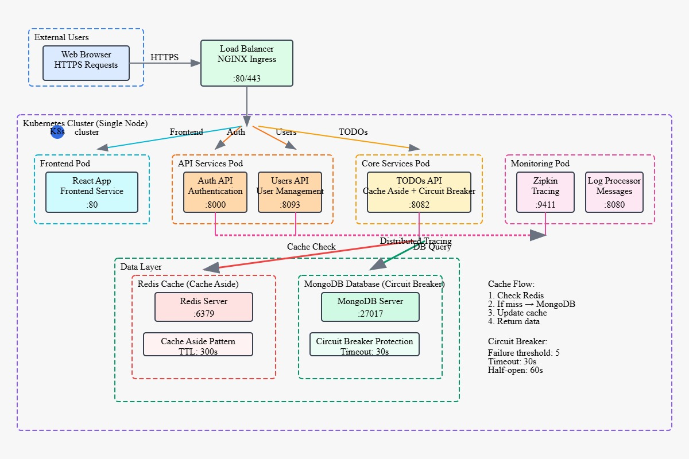

# Team Members
- A00395548 | Silem Nabib Villa Contreras
- A00382203 | Santiago Escobar Leon

# Table of Contents
- [Introduction](#introduction)
- [Branching Strategies](#branching-strategies)
- [Selected Cloud Patterns](#selected-cloud-patterns)
- [Architecture Diagram](#architecture-diagram)
- [Development Pipelines](#development-pipelines)
- [Infrastructure Pipelines](#infrastructure-pipelines)
- [Infrastructure Implementation](#infrastructure-implementation)
- [Demonstration](#demonstration)
- [Conclusions](#conclusions)

# Introduction
>TODO: Add introduction

# Branching Strategies

For this project, we have implemented the GitFlow branching strategy, which provides a robust framework for managing both development and operations workflows.

## Development Branching Strategy

Our development branching strategy follows the GitFlow model with the following branches:

- **main**: Production-ready code that has been thoroughly tested and is ready for deployment
- **develop**: Integration branch for features being developed
- **feature/\***: Individual feature branches created from and merged back into develop
- **hotfix/\***: Emergency fixes for production issues, branched from main and merged into both main and develop
- **release/\***: Preparation branches for releases, branched from develop and merged into main and develop

This strategy allows developers to work on features in isolation while maintaining a stable codebase.

## Operations Branching Strategy

For operations, we extend the GitFlow model with environment-specific branches:

- **env/dev**: Configuration specific to the development environment
- **env/prod**: Configuration specific to the production environment
- **infra/\***: Infrastructure changes that are tested in each environment sequentially

This approach ensures that infrastructure changes follow a controlled promotion path from development to production, reducing the risk of configuration drift and deployment issues.

# Selected Cloud Patterns
We will implement the following cloud design patterns:

### Cache-Aside Pattern

The Cache-Aside pattern is implemented in our TODOs API using Redis as the caching layer. This pattern improves performance by reducing database load and latency for frequently accessed data.

#### Implementation Details

**Technology Stack:**
- **Cache Store**: Redis (Cloud Memorystore in production)
- **Implementation**: Node.js with redis client
- **Cache Strategy**: Write-Around with selective invalidation

**Key Features:**
1. **Cache Key Strategy**: Hierarchical key naming for efficient organization
   - User todos: `todos:user:{username}`
   - Individual todos: `todo:{username}:{todoId}`

2. **Cache Operations**:
   - **Cache Hit**: Data retrieved directly from Redis (sub-millisecond response)
   - **Cache Miss**: Data fetched from MongoDB and cached for future requests
   - **Cache Expiry**: 5-minute TTL to ensure data freshness

3. **Write Strategy**: Write-Around pattern implementation
   - New data written directly to database
   - Cache invalidated after write operations
   - Prevents cache pollution with infrequently accessed data

4. **Error Handling**: Graceful degradation when Redis is unavailable
   - Cache failures don't break the application
   - Automatic fallback to database operations

**Performance Benefits:**
- Significantly reduced database load for frequently accessed data
- Improved response times for cached content
- Enhanced system scalability under high concurrent load

**Monitoring**: Comprehensive logging with `[CACHE-ASIDE]` prefixes for operational visibility.

### Circuit Breaker Pattern

The Circuit Breaker pattern is implemented to improve system resilience by preventing cascading failures when the database is unavailable or experiencing high latency.

#### Implementation Details

**Technology Stack:**
- **Library**: Opossum Circuit Breaker for Node.js
- **Target**: MongoDB database operations
- **Scope**: All CRUD operations in TODOs API

**Configuration:**
- **Timeout**: 5 seconds per operation
- **Error Threshold**: 50% failure rate triggers circuit opening
- **Reset Timeout**: 30 seconds before attempting recovery
- **Rolling Window**: 10 seconds with 10 buckets for failure tracking

**Circuit States:**
1. **Closed (Normal)**: All requests pass through to database
2. **Open (Failing)**: Requests immediately rejected, returns 503 Service Unavailable
3. **Half-Open (Testing)**: Limited requests allowed to test service recovery

**Protected Operations:**
- `find()` - List todos queries
- `findOne()` - Single todo retrieval
- `insertOne()` - Todo creation
- `deleteOne()` - Todo deletion
- `updateOne()` - Todo updates

**Error Handling:**
- **Circuit Open**: Returns HTTP 503 with "Service temporarily unavailable"
- **Timeout**: Returns HTTP 503 with "Database temporarily unavailable"
- **Other Errors**: Returns HTTP 500 with generic error message

**Monitoring & Health Checks:**
- Real-time circuit breaker statistics via `/health` endpoint
- Comprehensive event logging for all state transitions
- Integration with application health checks

**Benefits:**
- Prevents database overload during outages
- Faster failure detection and recovery
- Improved user experience with predictable error responses
- System stability under adverse conditions

# Architecture Diagram

The architecture for our microservices application is designed to leverage Google Cloud Platform services for optimal performance, scalability, and reliability. The diagram below illustrates the high-level architecture and the interactions between different components.

## Overview

  
  
<em>Architecture diagram showing the microservices components and their interactions</em>

# Development Pipelines
>TODO: Add development pipelines

# Infrastructure Pipelines
>TODO: Add infrastructure pipelines

# Infrastructure Implementation
>TODO: Add infrastructure implementation

# Demonstration
>TODO: Add demonstration

# Conclusions
>TODO: Add conclusions
